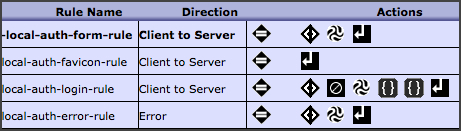
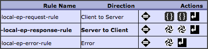

Using JWT x5c in DataPower
==========================

The repository contains some JavaScript code for processing JWT
tokens in DataPower using the `x5c` header for storing an x509
certificate.  This is useful for transmitting the public key
of the signer to 3rd party components in a distributed application.

## Background

The DataPower GatewayScript API already provides
a GatewayScript API for JWT.  But (as of Spring 2016) it
lacks support for using the `x5c` header
(as described in the
[JSON Web Signature Specification](https://tools.ietf.org/html/rfc7515))
to transmit the public key.
Instead, it relies on information local to the appliance
to identify a key on the appliance.  This information can
be used to retrieve a configured certificate on another appliance.
But the local key information is not much use for other systems
wishing to verify the JWT.

The `x5c` JWT header allows the issuer to store the entire
certificate within the token.  This allows any recipient of
the token to inspect the signing certificate and determine
whether to trust it.  The **drawback** is that including a
base64-encoded x509 certificate in a token contributes
significantly to its size (> 2kb).  I've noticed that most
browsers will (silently) refuse to store cookies greater
than 4kb.  (cURL, however, will not complain.)  So if your
JWT is already fat with a few dozen claims, an `x5c`
header may push it over the 4kb threshold.  This was the case
for my scenario; so I ultimately abandoned this.

## Design

I was using JWTs to implement a SAML Service Provider (SP)
that converted the SAML claims to JWT claims and saved the
JWT in a cookie on the browser to use for subsequent calls.
I divided the function into two DataPower components:

* __Authentication Server__ (AS) - implmented as a Web
  Token Service (WTS).  As the name implies, this service was responsible for
  1. authenticating a request
  2. generating a JWT if authentication succeeded
  3. redirecting the response back to the EP.

* __Enforcement Point__ (EP) - implemented as a MultiProtocol
  Gateway (MPGW).
  1. Receives request for resource.  If no JWT is present,
     redirect request to AS.
  2. If JWT is present, validate it.  If valid, relay
     request to backend.

I started this way because I felt the separation of concerns
would allow for reuse of the authentication server (AS) across
several enforcement point (EP) implementations.  I also like
how WTS services automatically loopback.
If I had to do
it again, I'd probably combine them into a single MPGW.  I didn't
have the occasion to implement more than one EP.  And having the
AS and EP listening on different ports complicated the configuration
of the HTTP redirects.

## GatewayScripts

The following describes GatewayScripts used to process the JWTs.
It does not attempt to describe the entire service such as implementation
of login forms, AAA policies, or error handling.

### Authentication Server

The authentication server (AS) was implemented with a WTS which
referenced the following policy.  Most of the rules are specific
to the application and won't be discussed in detail.  The first
rule accepts a redirect from the EP and returns a login page.
The second rule handles `favicon.ico` requests.  The fourth
rule handles errors.

The third rule is the meat of the AS.  It handles the form submitted
by the login page.  The AAA action performs identity extraction,
authorization and post processing that populates context variables
used by the downstream GatewayScript programs.  The `xform` action
invokes [x5c.xsl](x5c.xsl), an XSLT that simply reads a x509 certificate
into a context variable.  This was the only crypto operation for which
there was no support in the GatewayScript API (i.e. no GatewayScript
support for the equivalent of `dp:base64-cert` in the XSLT API).

The first GatewayScript action is `getClaims.js`.  This script
retrieves various claim values from context locations documented
in comments at the top of the script.  I sanitized this script
of SAML attribute processing since it was customer-specific and
had no relevance externally.

BTW, you may wonder where SAML attributes are coming from if I
used a local login page to authenticate (rather than an external
IDP).  This script is used in both local login and SAML single
sign-on (SSO) scenarios.  In the local login case, the user
information was stored in a way to mimic the SAML attributes
of an IDP.

The second Gateway script of `local-auth-login-rule` is
`createJWT.js`.  As the name implies, it actually constructs the
signed JWT.  It relies heavily on the DataPower GatewayScript
crypto API.

### Enforcement Point

The enforcement point (EP) was implemented as a MPGW.
The JWT portion is in the request rule (with a match-all action).

The first GatewayScript action is `verifyJWT.js`.
It extracts the cookie named `JWT` by default, but can be
configured by a script parameter.  Parsing the cookie is done
with a [cookie utlity](https://github.com/jshttp/cookie).
The GatewayScript crypto API is used to validate the signature.
If the signature is verified and the JWT is parsed, then the
JWT header and claims are stored in the following context
variables:

* header - `var://context/jwt/header`
* claims - `var://context/jwt/claims`

The second GatewayScript action is `processJWT.js`.
There are all kinds of ways one can process the JWT claims
(including not processing them at all and letting the backend
process them).  In this particular example, the claims
are converted to HTTP headers.  Of course, this is only
secure when the link to the backend is locked down through
the transport like a mutual-auth SSL tunnel.

## SAML to JWT

I included a script `saml2jwt.js` for demonstration purposes.
It was never used in production.  But it worked in a few test
cases I used.
